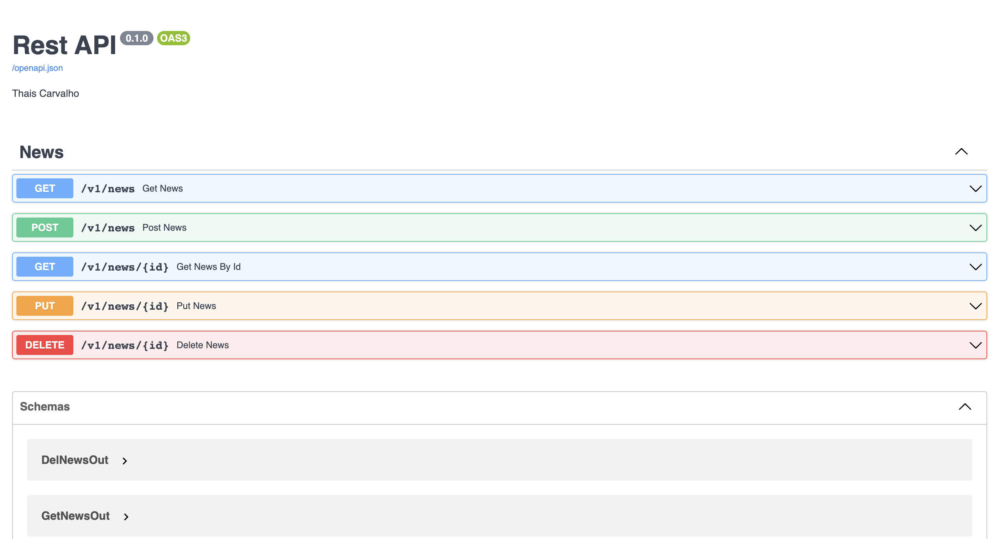
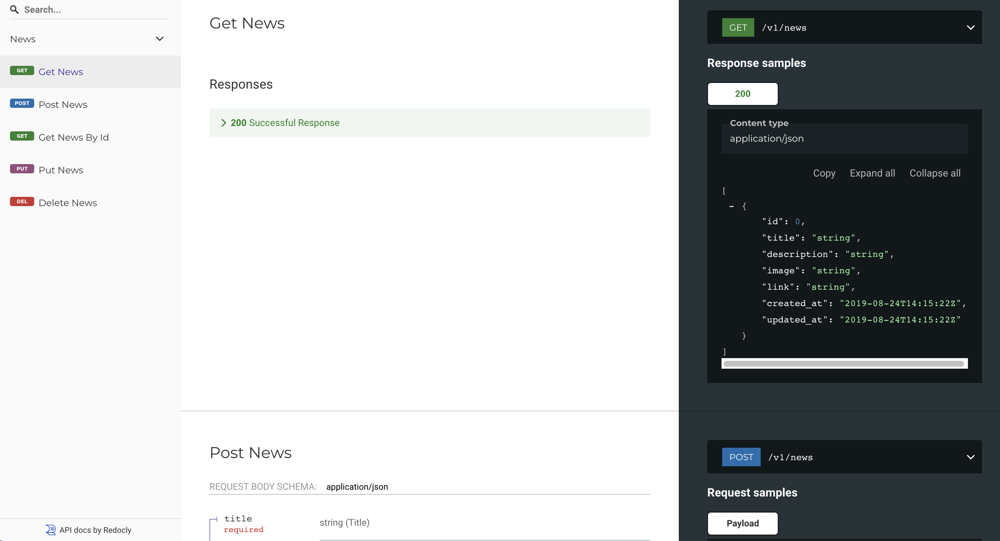

# API de notícias

Essa API fornece as notícias utilizadas no [Soccer News](../projetos/SoccerNews.md)

## Linguagen

- Python 

## Documentaçao

=== "Docs"
    <figure markdown>
        
        <figcaption>[Documentação da API](https://thais-restapi.herokuapp.com/docs)</figcaption>
    </figure>
=== "Redoc"
    <figure markdown>
        
        <figcaption>[Documentação da API](https://thais-restapi.herokuapp.com/redoc)</figcaption>
    </figure>

## Ferramentas

- Heroku 

- Visual Studio Code 

- FastAPI 	

## Repositório

[API de noticias](https://github.com/thaisperlho/crud-fastapi)