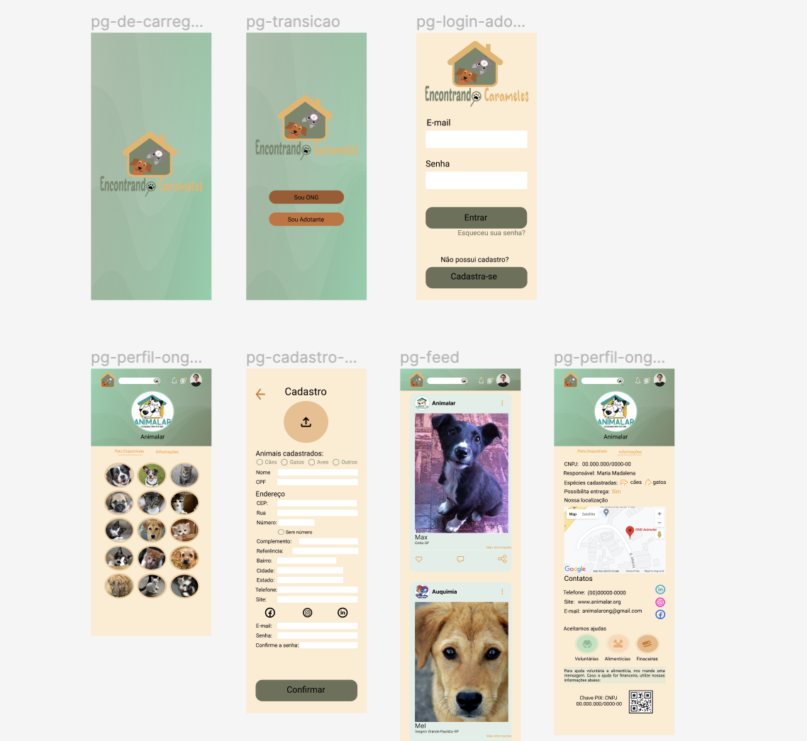
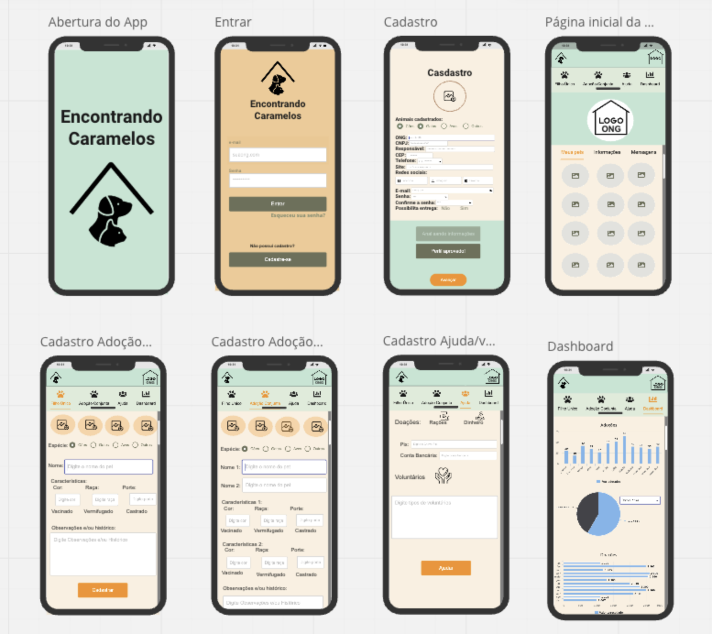
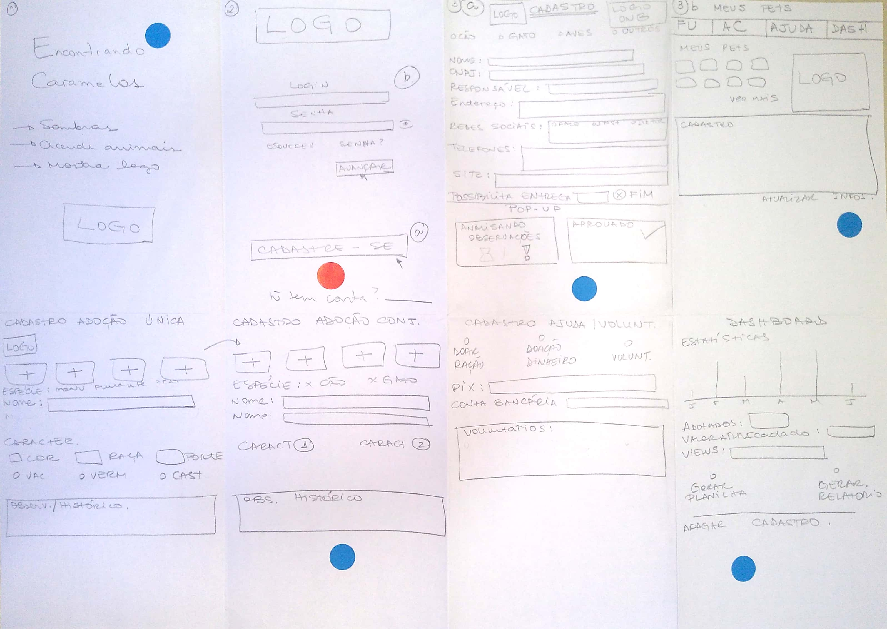
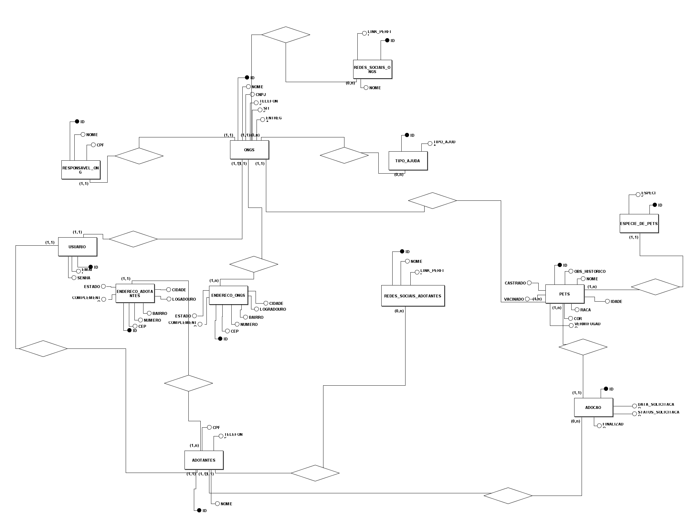
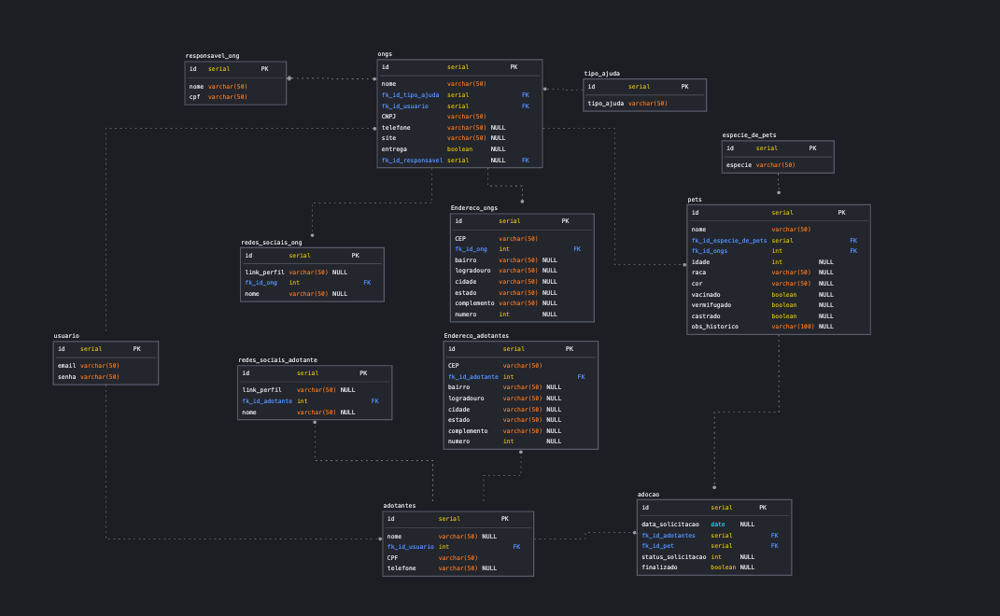
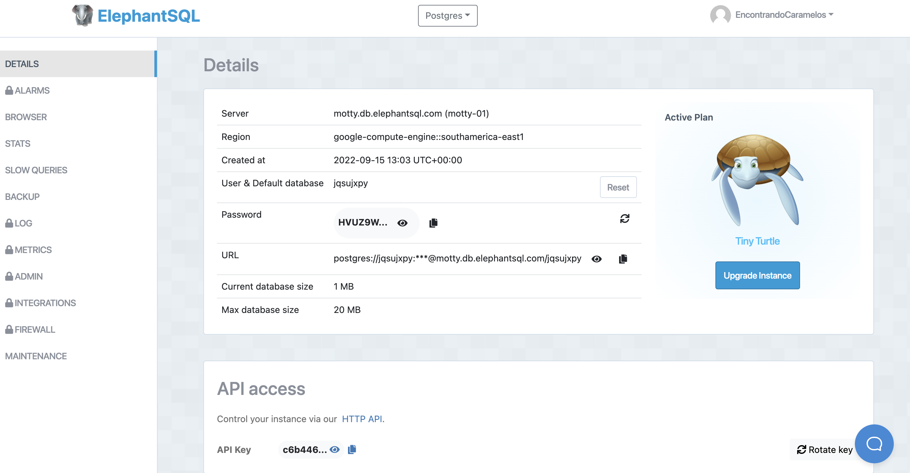

## 

## **Qual objetivo ?**

O objetivo do "Encontrando Caramelos" é diminuir maus-
tratos em animais de rua e proporcionar uma adoção rápida
e segura através de uma plataforma de fácil acesso,
atingindo de forma direta a qualidade de vida de todas as
partes envolvidas no processo (ONGs, Adotantes e pets).
Buscamos sempre atrair mais pessoas a se juntarem a esse
movimento que luta por uma vida mais adequada aos
animais vítimas de maus tratos.

## **Prototipação**

=== "Alta fidelidade"
    <figure markdown>
        
        <figcaption>[Figma - Alta fidelidade](https://www.figma.com/proto/7ZENBgVGgIMSutdCKGq56e/Protótipo-Alta-Fidelidade?node-id=283%3A506&scaling=scale-down&page-id=0%3A1)</figcaption>
    </figure>
=== "Baixa fidelidade"
    <figure markdown>
        
        <figcaption>[Miro - Baixa fidelidade](https://miro.com/app/board/uXjVO_SET7k=/?share_link_id=235870806066)</figcaption>
    </figure>
=== "Rabiscoframe"
    <figure markdown>
        
        <figcaption>Rabiscoframe</figcaption>
    </figure>

## ** Banco de dados **

### Projeto de Banco de Dados Relacional

=== "Conceitual"
    <figure markdown>
        
        <figcaption>Modelo conceitual</figcaption>
    </figure>

=== "Lógico"
    <figure markdown>
        
        <figcaption>Modelo Lógico</figcaption>
    </figure>

### Script 

O banco foi criado utilizando postegres	 

```sql
CREATE TABLE usuario
(
 "id"    serial NOT NULL,
 email varchar(50) NOT NULL,
 senha varchar(50) NOT NULL,
 CONSTRAINT PK_usuario PRIMARY KEY ( "id" )
);
CREATE TABLE responsavel_ong
(
 "id"   serial NOT NULL,
 nome varchar(50) NOT NULL,
 cpf  int NOT NULL,
 CONSTRAINT PK_responsavel_ong PRIMARY KEY ( "id" )
);

CREATE TABLE tipo_ajuda
(
 "id"         serial NOT NULL,
 tipo_ajuda varchar(50) NOT NULL,
 CONSTRAINT PK_tipo_ajuda PRIMARY KEY ( "id" )
);

CREATE TABLE ongs
(
 "id"                serial NOT NULL,
 nome              varchar(50) NOT NULL,
 fk_id_tipo_ajuda  serial NOT NULL,
 fk_id_usuario     serial NOT NULL,
 CNPJ              int NOT NULL,
 telefone          int NULL,
 site              varchar(50) NULL,
 entrega           boolean NULL,
 fk_id_responsavel serial NOT NULL,
 CONSTRAINT PK_ongs PRIMARY KEY ( "id" ),
 CONSTRAINT FK_1 FOREIGN KEY ( fk_id_usuario ) REFERENCES usuario ( "id" ),
 CONSTRAINT FK_2 FOREIGN KEY ( fk_id_responsavel ) REFERENCES responsavel_ong ( "id" ),
 CONSTRAINT FK_4 FOREIGN KEY ( fk_id_tipo_ajuda ) REFERENCES tipo_ajuda ( "id" )
);

CREATE INDEX FK_1 ON ongs
(
 fk_id_usuario
);

CREATE INDEX FK_2 ON ongs
(
 fk_id_responsavel
);

CREATE INDEX FK_3 ON ongs
(
 fk_id_tipo_ajuda
);

CREATE TABLE Endereco_ongs
(
 "id"          serial NOT NULL,
 CEP         varchar(50) NOT NULL,
 fk_id_ong   int NOT NULL,
 bairro      varchar(50) NULL,
 logradouro  varchar(50) NULL,
 cidade      varchar(50) NULL,
 estado      varchar(50) NULL,
 complemento varchar(50) NULL,
 numero      int NULL,
 CONSTRAINT PK_Endereco PRIMARY KEY ( "id" ),
 CONSTRAINT FK_4 FOREIGN KEY ( fk_id_ong ) REFERENCES ongs ( "id" )
);

CREATE INDEX FK_4 ON Endereco_ongs
(
 fk_id_ong
);

CREATE TABLE adotantes
(
 "id"            serial NOT NULL,
 nome          varchar(50) NULL,
 fk_id_usuario int NOT NULL,
 CPF           int NOT NULL,
 telefone      int NULL,
 CONSTRAINT PK_adotantes PRIMARY KEY ( "id" ),
 CONSTRAINT FK_5 FOREIGN KEY ( fk_id_usuario ) REFERENCES usuario ( "id" )
);

CREATE INDEX FK_5 ON adotantes
(
 fk_id_usuario
);

CREATE TABLE redes_sociais_adotante
(
 "id"             serial NOT NULL,
 link_perfil    varchar(50) NULL,
 fk_id_adotante int NOT NULL,
 nome           varchar(50) NULL,
 CONSTRAINT PK_redes_sociais PRIMARY KEY ( "id" ),
 CONSTRAINT FK_6 FOREIGN KEY ( fk_id_adotante ) REFERENCES adotantes ( "id" )
);

CREATE INDEX FK_6 ON redes_sociais_adotante
(
 fk_id_adotante
);

CREATE TABLE redes_sociais_ong
(
 "id"          serial NOT NULL,
 link_perfil varchar(50) NULL,
 fk_id_ong   int NOT NULL,
 nome        varchar(50) NULL,
 CONSTRAINT PK_redes_sociais_ong PRIMARY KEY ( "id" ),
 CONSTRAINT FK_7 FOREIGN KEY ( fk_id_ong ) REFERENCES ongs ( "id" )
);

CREATE INDEX FK_7 ON redes_sociais_ong
(
 fk_id_ong
);

CREATE TABLE Endereco_adotantes
(
 "id"             serial NOT NULL,
 CEP            varchar(50) NOT NULL,
 fk_id_adotante int NOT NULL,
 bairro         varchar(50) NULL,
 logradouro     varchar(50) NULL,
 cidade         varchar(50) NULL,
 estado         varchar(50) NULL,
 complemento    varchar(50) NULL,
 numero         int NULL,
 CONSTRAINT PK_Endereco_adotante PRIMARY KEY ( "id" ),
 CONSTRAINT FK_14 FOREIGN KEY ( fk_id_adotante ) REFERENCES adotantes ( "id" )
);

CREATE INDEX FK_14 ON Endereco_adotantes
(
 fk_id_adotante
);


CREATE TABLE especie_de_pets
(
 "id"      serial NOT NULL,
 especie varchar(50) NOT NULL,
 CONSTRAINT PK_especie_de_pets PRIMARY KEY ( "id" )
);

CREATE TABLE pets
(
 "id"                  serial NOT NULL,
 nome                  varchar(50) NOT NULL,
 fk_id_especie_de_pets serial NOT NULL,
 fk_id_ongs            serial NOT NULL,
 idade                 int NULL,
 raca                  varchar(50) NULL,
 cor                   varchar(50) NULL,
 vacinado              boolean NULL,
 vermifugado           boolean NULL,
 castrado              boolean NULL,
 obs_historico         varchar(100) NULL,
 CONSTRAINT PK_pets PRIMARY KEY ( "id" ),
 CONSTRAINT FK_10 FOREIGN KEY ( fk_id_ongs ) REFERENCES ongs ( "id" ),
 CONSTRAINT FK_11 FOREIGN KEY ( fk_id_especie_de_pets ) REFERENCES especie_de_pets ( "id" )
);

CREATE INDEX FK_10 ON pets
(
 fk_id_ongs
);

CREATE INDEX FK_11 ON pets
(
 fk_id_especie_de_pets
);

CREATE TABLE adocao
(
 "id"               serial NOT NULL,
 data_solicitacao   date NOT NULL,
 fk_id_adotantes    serial NOT NULL,
 fk_id_pet          serial NOT NULL,
 status_solicitacao int NULL,
 finalizado         boolean NULL,
 CONSTRAINT PK_adocao PRIMARY KEY ( "id" ),
 CONSTRAINT FK_12 FOREIGN KEY ( fk_id_pet ) REFERENCES pets ( "id" ),
 CONSTRAINT FK_13 FOREIGN KEY ( fk_id_adotantes ) REFERENCES adotantes ( "id" )
);

CREATE INDEX FK_12 ON adocao
(
 fk_id_pet
);

CREATE INDEX FK_13 ON adocao
(
 fk_id_adotantes
);

```

## Serviços

- ElephanteSQL

ElephantSQL é um serviço de hospedagem de banco de dados PostgreSQL. O ElephantSQL gerenciará tarefas administrativas do PostgreSQL, como instalação, atualizações para a versão estável mais recente e tratamento de backup.



## Repositório

[Banco de Dados](https://github.com/thaisperlho/BD-EncontrandoCaramelos)