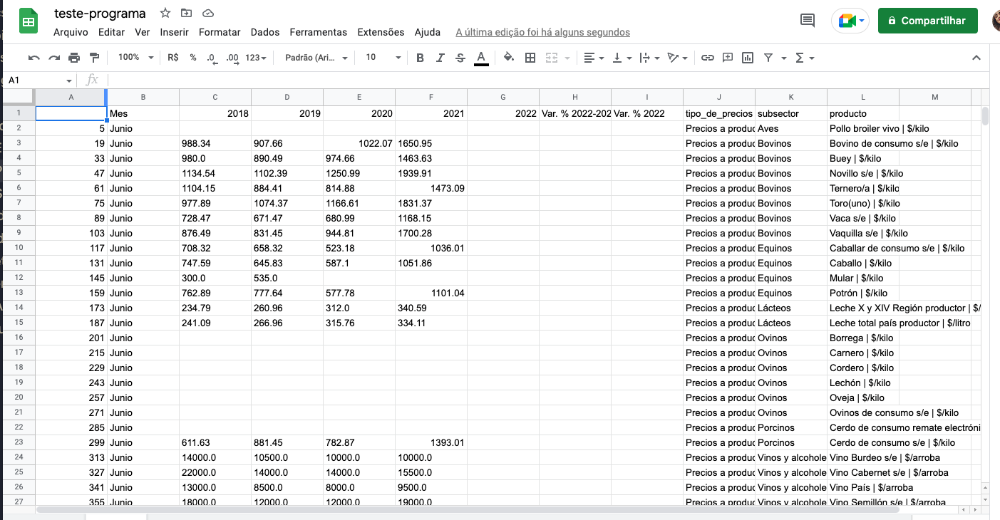

# Programa de Pesquisa de Produtos

Esse programa foi realizado para um trabalho freelancer, fiz o levantamento de alguns produtos e as suas respetivas informações.

**[Site de Pesquisa](https://www.odepa.gob.cl/precios/avance-por-productos)**


## Objetivo

- Fazer o levantamento de dados incluindo:
    * [x] Categorias.
    * [x] Produtos.
    * [x] Preço de cada produto.
- Salvar em um arquivo em: 
<<<<<<< HEAD
    * [x] csv.
=======
    * [x] cvc 
>>>>>>> baf8e54 (docs: update PesquisaDeProdutos.md)
    * [x] xlsx.

## Ferramentas

- Google Colab que já oferece o 

- Visual Studio Code 

## Linguagen

- Python 

## Bibliotecas

```python
import requests, json 
from pprint import pprint
from rich.table import Table
from rich.console import Console
import pandas as pd
from time import sleep
from datetime import datetime
```

## Código

```python
console = Console()

uri_subsector = "https://aplicativos.odepa.gob.cl/series-precios/results/pc-grupos?tipoMercado="
uri_productor = "https://aplicativos.odepa.gob.cl/series-precios/results/productos-by-pc-sm?grupo={sub_id}"
data = {
    "mercados": {
        "1": {
            "name": "Precios a productor",
            "url": "https://aplicativos.odepa.gob.cl/series-precios/results/sub-sectores-by-tipo-mercado?tipoMercado=1",
            "url_productor": "https://aplicativos.odepa.gob.cl/series-precios/results/productos-by-sub-sector?subSector={sub_id}&tipoMercado=1",
            "subsector": None
        },
        "3": {
            "name": "Precios a consumidor Supermercado",
            "url": uri_subsector + "3",
            "url_productor": uri_productor,
            "subsector": None
        },
        "7": {
            "name": "Precios a consumidor Minoristas",
            "url": uri_subsector + "7",
            "url_productor": uri_productor,
            "subsector": None,
        },
    }
}

#Para rodar todas as opções deixe ALL_OPTION como True
#Caso seja False você precisará selecionar todas as opções desejadas
ALL_OPTION = True
#ALL_OPTION = False
# Altere a data de termino
PERIODO_TERMINO = '01/05/2022'
# Se o mês for igual a None ele busca o historico 
MES = None
#MES = "Junio"
FILENAME = "drive/MyDrive/project-chile/teste"
FILETYPE = "csv" #excel

#Selecinando os tipos de precios
def select_mercado():
    console.rule("INÍCIO")
    console.rule("SELECIONE OS SUBSECTORS DOS TIPOS DE PRECIOS")
    console.rule("")
    table  = Table(title="Tabela - Tipo de Precios")
    table.add_column("Cód", justify="right", width=8)
    table.add_column("Tipo de Precios", width=150)
    mercado_index = {}
    #table.add_row("0", "Todas opções abaixo", style="green")
    for index_mer, key_mer in enumerate(data["mercados"].keys()):
        mercado_index.update({index_mer: key_mer})
        table.add_row(str(index_mer + 1), data["mercados"][key_mer]["name"])
    console.print(table)
    if ALL_OPTION:
        mer_ids = list(data["mercados"].keys())
    else:
        mer_options = console.input("Digite quais tipo de precios deseja buscar: ")
        mer_ids = [
                mercado_index.get(int(index) - 1)
                for index in mer_options.split(sep=" ") 
                if index.isnumeric() and mercado_index.get(int(index) - 1)]
    console.rule("FIM")
    print("\n\n")
    return mer_ids

#Selecionando os subsectors
def select_subsectors():
    mer_ids = select_mercado()
    console.rule("INÍCIO", style="cyan")
    console.rule("SELECIONE OS SUBSECTORS DOS TIPOS DE PRECIOS", style="cyan")
    console.rule("", style="cyan")

    for mer_id in mer_ids:
        uri_mercado = data["mercados"][mer_id]["url"]
        resp_sub = requests.api.get(uri_mercado).json()
        table = Table(title=f"{data['mercados'][mer_id]['name']} - Subsectors")
        table.add_column("Cód", justify="right", width=8)
        table.add_column("Nome Subsector", width=150)
        #table.add_row("0", "Todas opções abaixo", style="cyan")
        for index_sub in range(1, len(resp_sub) + 1):
            if "glosa" in resp_sub[index_sub - 1]:
                name_sub =  resp_sub[index_sub - 1]["glosa"]
            else:
                name_sub =  resp_sub[index_sub - 1]["sseDes"]
            table.add_row(str(index_sub), name_sub)
        console.print(table)
        if ALL_OPTION:
            sub_options = list(range(1, len(resp_sub) + 1))
        else:
            sub_options = console.input("Digite quais tipos de subsectors deseja buscar: ")
            sub_options = [int(s) for s in sub_options.split(sep=" ") if s.isnumeric()]
        subsector = {}
        for sub_option in sub_options:
            sub_data = resp_sub[sub_option - 1]
            if "sseCod" in sub_data:
                values_sub = {sub_data["sseCod"] : {"name": sub_data["sseDes"]}}
            else:
                values_sub = {sub_data["id"] : {"name": sub_data["glosa"]}}
            subsector.update(values_sub)
        data["mercados"][mer_id]["subsector"] = subsector
    console.rule("FIM", style="cyan")
    print("\n\n")
    return mer_ids

#Selecionando os productors
def select_productors():
    mer_ids = select_subsectors()
    console.rule("INÍCIO", style="yellow")
    console.rule("SELECIONE OS PRODUCTORS DOS SUBSECTORS", style="yellow")
    console.rule("", style="yellow")

    for mer_id in mer_ids:
        sub_ids = data["mercados"][mer_id]["subsector"]
        for sub_id in sub_ids:
            uri = data["mercados"][mer_id]["url_productor"]
            uri = uri.format(sub_id=sub_id)
            resp_prod = requests.api.get(uri).json()

            table = Table(title=f"{sub_ids[sub_id]['name']} - Productors")
            table.add_column("Cód", justify="right", width=8)
            table.add_column("Nome Productor", width=150)
            #table.add_row("0", "Todas opções abaixo", style="yellow")
            for index_prod in range(1, len(resp_prod) + 1):
                if "glosaFull" in resp_prod[index_prod - 1]:
                    name_prod =  resp_prod[index_prod - 1]["glosaFull"]
                else:
                    name_prod =  resp_prod[index_prod - 1]["producto"]
                table.add_row(str(index_prod), name_prod)
            console.print(table)
            if ALL_OPTION:
                prod_options = list(range(1, len(resp_prod) + 1))
            else:
                prod_options = console.input("Digite quais productors deseja buscar: ")
                prod_options = [int(p) for p in prod_options.split(sep=" ") if p.isnumeric()]
            productors = {}
            for prod_option in prod_options:
                prod_data = resp_prod[prod_option - 1]
                if "glosaFull" in prod_data:
                    values_prod = {prod_data["id"] : prod_data["glosaFull"]}
                else:
                    values_prod = {prod_data["id"] : prod_data["producto"]}
                productors.update(values_prod)
            data["mercados"][mer_id]["subsector"][sub_id]["productors"] = productors
    console.rule("FIM", style="yellow")
    print("\n\n")
    return mer_ids

#Pegando os prices
def get_prices(uri_prices, mer_id, sub_id, prod_id):
    console.rule(f"Buscando dados do mer_id: {mer_id}, sub_id: {sub_id}, prod_id: {prod_id}", style="magenta")
    json_data = {
        'periodoInicio': '01/01/2018',
        'periodoTermino': PERIODO_TERMINO,
        'tipoConsulta': 'nominal',
        'idIPC': 6372,
        'tipoMercado': int(mer_id),
        'precioConIva': False,
        'subSector': sub_id,
        'producto': prod_id,
    }

    for i in range(5):
        response = requests.post(uri_prices, json=json_data, )#headers=headers, cookies=cookies)
        console.rule(f"status_code: {response.status_code} - Sucesso: {response.ok}", style="magenta")
        if response.ok:
            return response.json()
        console.print(f"Aguardado 5 segundos para tentar novamente. Tentativa: {i + 1} de 5!")
        console.print(response.text)
        sleep(5)
        if i == 4:
            console.print("Nāo foi possível pegar os dados para os ids abaixo.")
            console.rule(f"mer_id: {mer_id}, sub_id: {sub_id}, prod_id: {prod_id}", style="red")
 
def get_options():
    console.rule("")
    console.rule("INICIANDO PROCESSO DE BUSCA DE DADOS")
    console.rule("")
    print("\n")
    uri_prices = 'https://aplicativos.odepa.gob.cl/series-precios/results/avance-por-productos'
    results = []
    mer_ids = select_productors()
    for mer_id in mer_ids:
        sub_ids = data["mercados"][mer_id]["subsector"]
        for sub_id in sub_ids:
            productors = data["mercados"][mer_id]["subsector"][sub_id]["productors"]
            for prod_id in productors:
                resp = get_prices(uri_prices=uri_prices, mer_id=mer_id, sub_id=sub_id, prod_id=prod_id)
                values = {"mer_id": mer_id, "sub_id": sub_id, "prod_id": prod_id, "values": resp}
                results.append(values)
    print("\n")
    return results

def normalize_data(results):
    console.rule("", style="yellow")
    console.rule("ININICIANDO NORMALIZAÇÃO DOS DADOS", style="yellow")
    console.rule("", style="yellow")
    data_precios = []
    for i in range(len(results)):
        mer_id = results[i]["mer_id"]
        sub_id = results[i]["sub_id"]
        prod_id = results[i]["prod_id"]

        mer_name = data["mercados"][mer_id]["name"]
        sub_name = data["mercados"][mer_id]["subsector"][sub_id]["name"]
        prod_name = data["mercados"][mer_id]["subsector"][sub_id]["productors"][prod_id]
        for index in range(len(results[i]["values"]["resultAvanceProducto"])):
            results[i]["values"]["resultAvanceProducto"][index].update(
                {
                    "tipo_de_precios": mer_name,
                    "subsector": sub_name,
                    "producto": prod_name
                }
            )
            data_precios.append(results[i]["values"]["resultAvanceProducto"][index])
    console.rule("", style="yellow")
    console.rule("FINALIZANDO NORMALIZAÇÃO DOS DADOS", style="yellow")
    console.rule("", style="yellow")
    return data_precios

def create_dataframe(data_precios: list):
    console.rule("", style="cyan")
    console.rule("INICIANDO CRIAÇÃO DO DATAFRAME", style="cyan")
    console.rule("", style="cyan")
    df = pd.DataFrame(data_precios)
    df.rename(
        columns={
            'glosa':'Mes', 
            'ano1':'2018', 
            'ano2':'2019', 
            'ano3':'2020', 
            'ano4':'2021', 
            'ano5':'2022', 
            'var1': 'Var. % 2022-2021',
            'var2': 'Var. % 2022'
        }, inplace = True )
    if MES:
        df = df[df["Mes"] == MES]
    console.rule("", style="cyan")
    console.rule("FINALIZANDO CRIAÇÃO DO DATAFRAME", style="cyan")
    console.rule("", style="cyan")
    return df

def create_file(df: pd.DataFrame, filename: str, type_file: str):
    if type_file == "excel":
        df.to_excel(f"{filename}.xlsx")
    else:
        df.to_csv(f"{filename}.csv")
    console.rule("", style="magenta")
    console.rule("FINALIZANDO CRIAÇÃO DO ARQUIVO", style="magenta")
    console.rule("", style="magenta")

def main():
    results = get_options()
    data_precios = normalize_data(results=results)
    dataframe = create_dataframe(data_precios=data_precios)
    console.rule("", style="magenta")
    console.rule("INICIANDO CRIAÇÃO DO ARQUIVO", style="magenta")
    console.rule("", style="magenta")
    type_file = FILETYPE
    filename = FILENAME
    create_file(df=dataframe, filename=filename, type_file=type_file)
    console.rule("")
    console.rule("FINALIZANDO PROCESSO DE BUSCA DE DADOS")
    console.rule("")
    return dataframe

dataframe = main()
```

## Resultado

- Print do arquivo teste




## Repositório

[Pesquisa de Produtos](https://github.com/thaisperlho/project-prices-products-chile)

