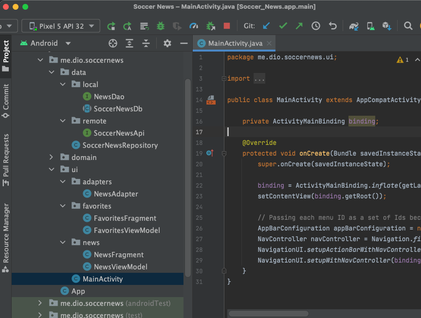
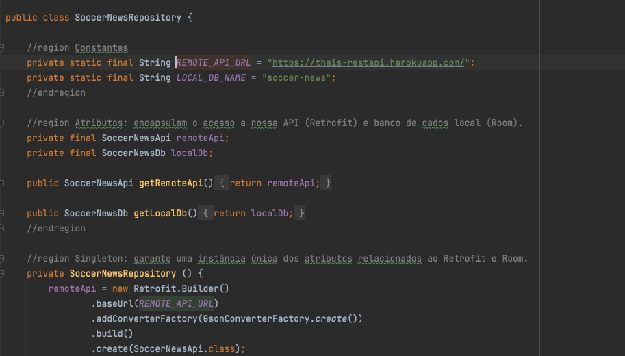
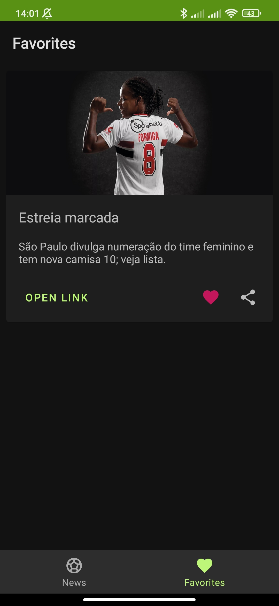

# Soccer News { align=center }
Um aplicativo de notícias sobre fultebol Feminino :octicons-heart-fill-24:{ .heart}

Esse é um projeto mobile desenvolvido para o sistema operacional Android 

## Quais as funcionalidades ?

- Feed com as notícias disponiveis.
- Conseguir ser redirecionado para a notícia completa.
- Marca como favoritas.
- Compartilhar as notícias.

## Ferramentas

- IDE Android Studio 
- Firebase 

## Linguagem

- 

## Classes e Pacotes

Todo o projeto esta no [Soccer News](https://github.com/thaisperlho/Soccer-News) meu repositório no Github 

## Conexão com API

Criei uma [API](../api/api1.md) para fornecer as notícias e informações. Utilizei o Retrofit.

## Interface

=== "Feed"
    <figure markdown>
        
        <figcaption>Tela do Feed</figcaption>
    </figure>

=== "Favoritas"
    <figure markdown>
        
        <figcaption>Tela de Favoritos</figcaption>
    </figure>

## APK para teste

Faça parte do meu grupo de testadores e apoiadores no Firebase clicando [AQUI](https://appdistribution.firebase.dev/i/f5e0d9b8b2451440), assim te envio a APK para que possa instalar e testar em seu smartphone 

